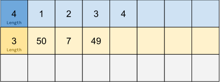
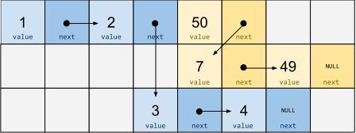
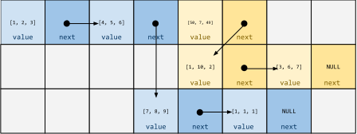
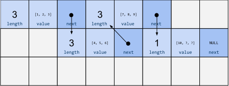
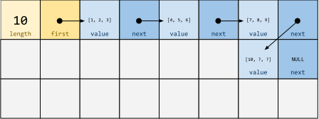
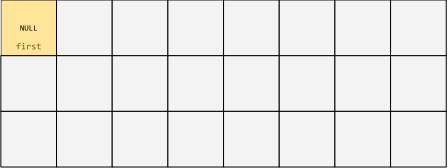
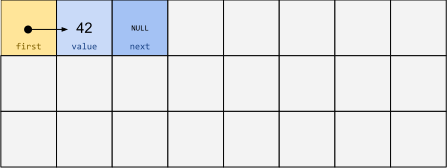
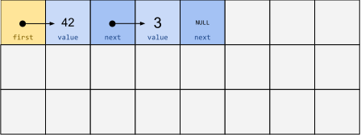

# Dynamische structuren <!-- omit in toc -->

## Inhoudstafel <!-- omit in toc -->

- [Video](#video)
- [Introductie](#introductie)
- [Lijsten](#lijsten)
- [Dynamische lijsten](#dynamische-lijsten)
  - [ArrayList](#arraylist)
  - [Linked List implementatie](#linked-list-implementatie)
    - [`list_create`](#list_create)
    - [`list_append`](#list_append)
      - [Lege lijst](#lege-lijst)
      - [Lijst met meerdere elementen](#lijst-met-meerdere-elementen)
    - [`list_print`](#list_print)
    - [`list_destroy`](#list_destroy)
    - [Oefeningen](#oefeningen)

## Video

[](https://www.youtube.com/watch?v=NBNHEppt7d8)

## Introductie

In de vorige les hebben we geleerd hoe `malloc` gebruikt kan worden om dynamisch objecten in het geheugen aan te maken.
Hiermee kunnen we zelf de levensduur bepalen van een object.

Dynamische geheugenallocatie maakt dynamische gegevensstructuren mogelijk.
Dynamische gegevensstructuren nemen een variabele hoeveelheid geheugen in doorheen de uitvoering van een programma.
Een voorbeeld is de lijst.
Aan de hand van dit voorbeeld leggen we in deze les het concept van dynamische gegevensstructuren uit.

## Lijsten

Lijsten zijn verzamelingen van opeenvolgende getallen die kunnen variëren in lengte.
Terwijl een array in C een vaste lengte heeft en bijgevolg een vaste hoeveelheid geheugen inneemt, kan een lijst kan groter en kleiner worden.

Bekijk bijvoorbeeld de volgende python-code:

```bash
$ python
>>> list = []
>>> list
[]
>>> list.append(1)
>>> list
[1]
>>> list.append(2)
>>> list
[1, 2]
```

> **:question: Hoe zou je een lijst kunnen implementeren in een taal als C?**

Een mogelijke implementatie zou kunnen bestaat uit het reserveren van een zeer grote array.
Indien je dan ook ergens kan bijhouden hoeveel elementen er in deze array zitten op ieder moment, heb je een lijststructuur.

Onderstaande figuur geeft twee lijsten weer: de lijst `[1, 2, 3, 4]` en de lijst `[50, 7, 49]`.
Elke cel mag je beschouwen als een abstract geheugenobject.
In de figuur bevat elke lijst dus maximaal 7 objecten.



Dit soort lijsten zijn eenvoudig te implementeren in C.

> **:question: Bekijk onderstaande code aandachtig. Kijk of je de code begrijpt. Compileer de code en voer deze uit.**

> :information_source: Velden van een `struct` spreken we normaal met de operator `.` aan. Indien `ps` een pointer naar een `struct s` is, zou je dus een veld `field` kunnen aanspreken door te schrijven: `(*ps).field`. De operator `->` kan hier als alternatief gebruikt worden: `ps->field` doet exact hetzelfde. **Gebruik `->` enkel voor pointers naar structs!**

```c
#include <stdio.h>
#include <stdlib.h>

#define LIST_MAX_SIZE 100

struct List
{
    size_t length;
    int data[LIST_MAX_SIZE];
};

struct List list_create(void)
{
    struct List list;
    list.length = 0;
    return list;
}

void list_append(struct List *list, int value)
{
    if (list->length == LIST_MAX_SIZE)
    {
        return;
    }
    list->data[list->length] = value;
    list->length++;
}

void list_print(struct List *list)
{
    printf("[");
    for (int i = 0; i < list->length; i++)
    {
        printf("%d", list->data[i]);
        if (i < list->length - 1)
        {
            printf(",");
        }
    }
    printf("]\n");
}

int main(void)
{
    struct List list = list_create();
    list_print(&list);
    list_append(&list, 0);
    list_print(&list);
    list_append(&list, 1);
    list_print(&list);
    printf("The memory size of the list is %lu\n", sizeof(list));
    return 0;
}
```

> **:question: Waarom maken we gebruik van pointers in de functies `list_append` en `list_print`? Zou je deze functies kunnen implementeren zonder gebruik te maken van een pointer? Waarom wel/niet?**

De bovenstaande `list_create` functie is weinig efficiënt:

```C
struct List list_create(void)
{
    struct List list;
    list.length = 0;
    return list;
}
```

Op het eerste zicht lijkt dit misschien een logische implementatie en is het moeilijk te zien wat hier ineffciënt aan is.
Je maakt een `struct List` aan in een lokale variabele, met automatische levensduur.
De variabele `list` *stopt* met bestaan op het einde van de `list_create` functie.
De functie is gelukkig wel correct.
Het statement `return list;` maakt namelijk een volledige kopie van de zonet aangemaakte lijst.

Dit is inefficiënt wanneer de `struct` veel plaats inneemt.
Indien de lijst bijvoorbeeld `400 bytes` groot is, moeten al deze bytes gekopieerd worden in het `return` statement.

Misschien zou je deze inefficiëntie **foutief** proberen oplossen als volgt:

```C
struct List *list_create(void)
{
    struct List list;
    list.length = 0;
    return &list;
}
```

> **:question: Probeer, voor je verder leest, na te denken over wat hier net gebeurt. Zie je wat er misloopt?**

In plaats van een kopie te maken van de volledige struct, maken we enkel een kopie van het adres van de struct.
Het inefficiëntieprobleem is inderdaad opgelost.
Het probleem is hier dat het adres dat we teruggeven verwijst naar een variabele (`list`) *die niet meer bestaat* na de functie.
Indien dit adres verder gebruikt zal worden vertoont ons programma dus *undefined behavior*.

Hier komt dynamisch geheugen tot onze redding:

```C
struct List *list_create(void)
{
    struct List *list = malloc(sizeof(struct List));
    if (list == NULL)
    {
        return NULL;
    }
    list->length = 0;
    return list;
}
```

Bovenstaande implementatie is efficiënt.
We kopiëren enkel het adres en het adres dat we returnen verwijst naar een object dat blijft bestaan, tot we het zelf expliciet vernietigen.

Indien we deze implementatie gebruiken, moeten we echter ook een manier voorzien om al het geheugen terug vrij te geven:

```C
void list_destroy(struct List *list)
{
    free(list);
}
```

In dit geval lijkt het misschien overbodig om een aparte `destroy` functie te maken, de caller kan ook rechtstreeks `free` oproepen.
Dat klopt op zich.
In een complexere variant die we later in deze sessie zullen bespreken zal er echter meer clean-up moeten gebeuren, dit zorgt ervoor dat we onze lijstfuncties kunnen gebruiken zonder nadien code te moeten wijzigen, wanneer onze interne implementatie van de lijst wijzigt.

De volledige code met behulp van `malloc` kan je vinden in `examples/naive-list-malloc.c`.

> **:question: Voeg een functie `int list_pop(struct List *list)` toe aan bovenstaand programma. Deze functie verwijdert de laatste waarde uit een lijst en geeft deze waarde terug als resultaat. Hierbij mag je aannemen dat de gegeven lijst niet leeg is.**

## Dynamische lijsten

De lijst die we gemaakt hebben is echter geen dynamische gegevensstructuur.
De hoeveelheid geheugen die elke lijst inneemt ligt vast.
Lijsten kunnen dus niet langer worden dan de limiet die we zelf opleggen.
In dit geval is dat 100.
Indien je de limiet vergroot, zal je voor kleine lijsten enorm veel geheugen verspillen.
Indien de limiet klein blijft, zal je geen grote lijsten kunnen maken.

Om lijsten te maken zonder lengtelimieten kunnen we gebruik maken van een linked list (gelinkte lijst).
In een gelinkte lijst maken we gebruik van pointers om verschillende afzonderlijke delen van de lijst aan elkaar te linken.

In code zou je een `struct ListElement` kunnen definiëren met een waarde, bijvoorbeeld een `int`, en een pointer naar het volgende element in de lijst:

```C
struct ListElement
{
    int value;
    struct ListElement *next;
};
```
Per element in de gelinkte lijst kan je een `struct ListElement` aanmaken.
Vervolgens kan je ervoor zorgen dat de `next`-pointer van het eerste element verwijst naar het adres van het tweede element, de `next`-pointer van het tweede element verwijst naar het adres van de derde, enzovoort.
Het einde van de lijst kan je weergeven door in het `next`-veld de *null pointer* te bewaren.

Onderstaande afbeelding toont opnieuw de lijsten `[1, 2, 3, 4]` en `[50, 7, 49]`, nu geïmplementeerd als gelinkte lijsten:



Merk op dat we in deze representatie lijstelementen kunnen aanmaken en toevoegen zonder problemen.
Zolang er geheugen beschikbaar is kunnen we de lijst langer maken.
Daarnaast zal in deze representatie een korte lijst minder geheugen innemen dan een lange lijst, in tegenstelling tot onze eerdere representatie.

Deze lijstrepresentatie heeft wel een ander nadeel.
Voor ieder lijstelement moet er ruimte voor een pointer gereserveerd worden.
Stel dat een waarde in de lijst evenveel geheugen zou innemen als een pointer.
Op dat moment neemt deze lijst dus dubbel zoveel geheugen in als een array van vaste lengte.
We betalen voor onze flexibiliteit door meer geheugen nodig te hebben.

### ArrayList

Merk op dat een tussenoplossing echter ook mogelijk is.
We kunnen als waarde van de gelinkte lijst een array van ints (`int[]`) gebruiken, in plaats van een `int`.

```C
#define ARRAY_SIZE 3
struct ArrayListElement
{
    int value[ARRAY_SIZE];
    struct ArrayListElement *next;
};
```

Onderstaande afbeelding geeft de lijsten `[1, 2, 3, 4, 5, 6, 7, 8, 9, 1, 1, 1]` en `[50, 7, 49, 1, 10, 2, 3, 6, 7]` weer.



Aangezien we verschillende `Arrays` linken met behulp van pointers om zo een lijststructuur te bouwen, kunnen we deze structuur een `ArrayList` noemen.

> :warning: In de taal `Java` bestaat ook het type `ArrayList`, waarbij arrays gebruikt worden om een lijstimplementatie mogelijk te maken. De Java-aanpak is echter anders dan de aanpak die wij hier voorstellen. Het is in C mogelijk de Java-aanpak te volgen en omgekeerd. We beperken ons hier tot deze voorstelling omdat deze meer illustratief is over de werking van dynamisch geheugen.

<!-- TODO bonus over java arraylist -->

> **:question: Hoe zou je een lijst van lengte 10 voorstellen in de ArrayList-representatie waarbij elke array de lengte 3 heeft (`ARRAY_SIZE = 3`)?**

**Voorstel 1: Maak de laatste array korter**

Merk op dat het niet mogelijk is om de laatste pointer te laten verwijzen naar een element met een kortere array.
Het datatype van elk element (`struct ListElement`) *moet* hetzelfde zijn, en de grootte van de array in een `struct ListElement` ligt vast.
De `next`-pointer kan namelijk niet naar twee datatypen verwijzen.

Je zou een tweede `next`-pointer kunnen voorzien met een ander type, voor lijsten van andere grootte, maar het kan simpeler.

**Voorstel 2: Reserveer een waarde die het einde van de lijst aangeeft**

We kunnen beslissen om een waarde te reserveren (bijvoorbeeld 0) die het einde van de lijst aangeeft.
Het probleem is dat deze waarde vervolgens niet gebruikt kan worden in de lijst zelf.
Een string in C gebruikt deze aanpak.
Dit kan, omdat de ASCII waarde 0 hiervoor expliciet gereserveerd is.

> **:question: Hoe komt het dat het karakter `0` toch kan voorkomen in een C-string hoewel de ASCII waarde 0 gebruikt wordt om het einde van een string weer te geven?**

Indien je een lijst maakt van arbitraire `int`-waarden is deze aanpak echter niet handig.
Er zal één correcte `int`-waarde moeten bestaan die niet bewaard kan worden in de lijst.

**Voorstel 3: Bewaar de lengte van de lijst apart**

In ons eerste voorbeeld van een lijst, waarbij we arrays gebruikten van vaste grootte, bewaarden we de lengte van de lijst in een apart veld van de struct.

We zouden nu hetzelfde kunnen doen.
We bewaren het aantal elementen in elke deellijst in een apart veld:

```C
#define ARRAY_SIZE 3
struct ArrayListElement
{
    size_t length;
    int value[ARRAY_SIZE];
    struct ArrayListElement *next;
};
```

Onderstaande afbeelding toont de lijst `[1, 2, 3, 4, 5, 6, 7, 8, 9, 10]` met behulp van deze representatie:



Het jammere aan deze voorstelling is dat we per element nu ook nog eens een `length`-field moeten bewaren.
Indien `ARRAY_SIZE` groot genoeg is kan dat misschien relatief gezien weinig verschil maken, maar we kunnen toch beter.
Dit probleem kan opgelost worden door een metadata-structuur in te voeren.
We definiëren een extra `struct` genaamd `struct ArrayList`.
In deze tweede `struct` bewaren we een verwijzing naar het eerste element van onze lijst, en daarnaast ook de *totale* lengte van onze lijst.

```C
#define ARRAY_SIZE 3
struct ArrayListElement
{
    int value[ARRAY_SIZE];
    struct ArrayListElement *next;
};

struct ArrayList
{
    size_t length;
    struct ArrayListElement* first;
};
```

Onze lijst `[1, 2, 3, 4, 5, 6, 7, 8, 9, 10]` ziet er nu als volgt uit.
De metadatastructuur hebben we geel gemaakt voor de duidelijkheid.



Een nadeel aan de ArrayList-structuren is dat een `list_insert` methode, waarbij je een waarde toevoegt in het midden van de lijst, ervoor zal zorgen dat alle waarden na de insert moeten verplaatsen.

### Linked List implementatie

Tijd om te kijken naar een mogelijke implementatie van een linked list.
We gebruiken de simpele voorstelling waarmee we gestart waren, maar gebruiken ook een metadata-structuur.

```C
struct ListElement
{
    int value;
    struct ListElement *next;
};

struct List
{
    struct ListElement *first;
};
```

Deze gebruikt relatief veel geheugen (een extra pointer per element), maar maakt flexibele inserts in een lijst wel eenvoudiger.
De code is simpeler te volgen dan de code van de andere varianten.

#### `list_create`

Stel dat we een lege lijst willen aanmaken.
Op dat moment moeten we enkel een metadatastructuur aanmaken, zonder enig element.
We moeten er uiteraard voor zorgen dat first geïnitialiseerd wordt op `NULL`, dit gebeurt niet automatisch.

```C
struct List *list_create(void)
{
    struct List *list = malloc(sizeof(struct List));
    if (list == NULL)
    {
        return NULL;
    }
    list->first = NULL;
    return list;
}
```

Deze code maakt onderstaande structuur aan in het geheugen:

```C
struct ArrayList *list = list_create();
```



#### `list_append`

Om een element toe te voegen aan deze lijst gebruiken we de functie `int list_append(struct List *list, int value)`.

Deze moet een nieuw `struct ListElement` aanmaken, op een dynamische manier, zodat dit element kan blijven bestaan zelfs wanneer de functie `list_append` is afgelopen.

```C
struct ListElement *element = malloc(sizeof(struct ListElement));
element->value = value;
element->next = NULL;
```

Aangezien het nieuwe element aan het einde van de lijst wordt toegevoegd, zetten we de next-pointer op `NULL`.

##### Lege lijst

Indien de lijst leeg was, zoals hierboven afgebeeld, zullen we de `first`-pointer moeten aanpassen en onderstaande operaties moeten uitvoeren:

```C
if (list->first == NULL) //lege lijst
{
    list->first = element;
    return 0;
}
```

Het dynamisch geheugen na onderstaande code zou er als volgt uitzien:

```C
struct ArrayList *list = list_create();
list_append(list, 42);
```



##### Lijst met meerdere elementen

Indien een element moeten toevoegen aan een lijst met meerdere elementen, zullen we moeten zoeken naar het laatste element.
We kunnen dit doen, door de `next`-pointer te blijven volgen tot we het einde van de lijst bereiken.

```C
struct ListElement *last = list->first;
while (last->next != NULL)
{
    last = last->next;
}
```

Indien `last->next` niet `NULL` is, wil dit zeggen dat we het het laatste element in de lijst niet bereikt hebben.
Op dat moment vervangen we het adres bewaard in `last` door het adres in `last->next`, we nemen dus het volgende element in de lijst, en kijken daar opnieuw de `next`-pointer na.
Na deze code wijst `last` altijd naar het laatste element in de lijst.

Vervolgens moeten we `last->next` van het laatste element nog laten verwijzen naar ons nieuwe element:

```C
last->next = element;
```

Dit geeft ons de volledige code van `list_append`:

```C
int list_append(struct List *list, int value)
{
    if (list == NULL)
    {
        return -1;
    }
    struct ListElement *element = malloc(sizeof(struct ListElement));
    element->value = value;
    element->next = NULL;
    if (list->first == NULL)
    {
        list->first = element;
        return 0;
    }

    struct ListElement *last = list->first;
    while (last->next != NULL)
    {
        last = last->next;
    }
    last->next = element;
    return 0;
}
```

Het dynamisch geheugen na onderstaande code zou er als volgt uitzien:

```C
struct ArrayList *list = list_create();
list_append(list, 42);
list_append(list, 3);
```



#### `list_print`

De lijst printen is eenvoudig.
We doorlopen de volledige lijst met behulp van een `while`-loop, en printen elk element dat we tegenkomen.

```C
int list_print(struct List *list)
{
    if (list == NULL)
    {
        return -1;
    }

    struct ListElement *current = list->first;
    printf("[");
    while (current != NULL)
    {
        printf("%d", current->value);
        if (current->next != NULL)
        {
            printf(",");
        }
        current = current->next;
    }
    printf("]\n");
    return 0;
}
```

#### `list_destroy`

Belangrijk bij het gebruik van dynamisch geheugen is om het geheugen ook zelf terug vrij te geven.
Wanneer we de lijst niet meer nodig hebben, zullen we het volledige geheugen vrijgeven met `list_destroy`.

Hiervoor moeten we op elk element van de lijst de operatie `free` oproepen:

```C
struct ListElement *current = list->first;
while (current != NULL)
{
    struct ListElement *to_free = current;
    current = current->next;
    free(to_free);
}
```

> **:question: Waarom hebben we de variabele `to_free` nodig? Kunnen we `free` niet oproepen op `current`?**

Ten slotte moet ook de metadatastructuur zelf vrijgegeven worden:

```C
free(list);
```

De volledige implementatie wordt gegeven door

```C
int list_destroy(struct List *list)
{
    if (list == NULL)
    {
        return -1;
    }

    struct ListElement *current = list->first;
    while (current != NULL)
    {
        struct ListElement *to_free = current;
        current = current->next;
        free(to_free);
    }

    free(list);

    return 0;
}
```

> **:question: In voorgaande functies controleerden we telkens of de parameter `list` niet gelijk was aan `NULL`. Wat zou er gebeuren moesten we deze check niet uitvoeren, en onze functies aangeroepen werden met de waarde `NULL` als argument?**

#### Oefeningen

Maak de oefeningen in deze sectie om inzicht te krijgen in de werking van dynamisch geheugen.
Je kan hiervoor werken in het bestand `examples/linked-list.c`.

* Schrijf een functie `int list_get(struct List *list, int index, int *value)`.

De functie zoekt het element op de meegeleverde `index` en schrijft dit resultaat naar het adres in `value`.
Indien de meegegeven `index` in de lijst niet geldig is, geef dan de waarde `-1` terug.
Indien de meegegeven `lijst` zelf niet geldig is, geef dan ook `-1` terug.
Geef `0` terug indien de functie succesvol uitgevoerd is.

De functie wordt als volgt gebruikt:

```C
struct List *list = list_create();
list_print(list);
list_append(list, 42);
int return_value;
list_get(list, 0, &return_value);
printf("The value at index 0 was %d", return_value);
```

We gebruiken in deze functie dus in feite een parameter als tweede `return`-waarde.

* Schrijf een functie `int list_remove(struct List* list, int index)`.

Deze functie verwijdert het element op de meegeleverde `index` uit de lijst.
Zorg ervoor dat het geheugen correct wordt vrijgegeven en alle pointers correct worden.
Test je functie door een lijst aan te maken met enkele elementen en uit die lijst:

* Het eerste element te verwijderen
* Het laatste element te verwijderen
* Een element uit het midden te verwijderen

<!-- TODO bonus: Java ArrayList -->
