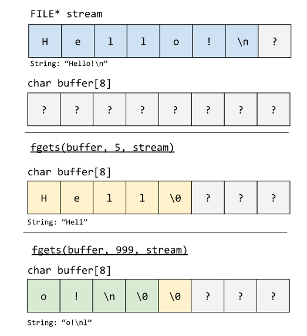

# System Interaction <!-- omit in toc -->

## Inhoudstafel <!-- omit in toc -->

- [Video](#video)
- [Introductie](#introductie)
- [Programma-argumenten](#programma-argumenten)
- [Standard streams](#standard-streams)
  - [Output streams](#output-streams)
  - [Input streams](#input-streams)
    - [`fgetc`](#fgetc)
    - [`fgets`](#fgets)
- [Files](#files)
- [Man pages](#man-pages)

## Video

[](https://www.youtube.com/watch?v=GJ-pwW_ADgk)

## Introductie

Tot nu toe hebben we programma's geschreven met weinig systeeminteractie.
We hebben `printf` gebruikt om uitvoer te printen en `malloc` gebruikt om dynamisch geheugen te vragen.
C biedt echter nog veel meer functionaliteit om met het onderliggende systeem te interageren.

In deze les nemen we een kijkje naar zaken als programma-input en file I/O.

## Programma-argumenten

Alle programma's die we tot hiertoe besproken hebben maakten gebruik van een main-functie zonder parameters: `int main(void);`.

Er is echter een tweede correcte manier om de main-functie te schrijven: `int main(int argc, char* argv[])`.
Met deze variant van `main` kan je programma opgeroepen worden met argumenten.

De variabele `argc` staat voor *argument count* en geeft zoals de naam zegt, het aantal argumenten weer die meegegeven zijn aan het programma.
De waarde zal nooit negatief zijn.

De variabele `argv` staat voor *argument vector*.
`argv` stelt een array van strings voor.
Indien `argc` groter is dan `0`, zal `argv[0]` *altijd* de naam van het programma bevatten.
De waarden `argv[1]` tot en met `argv[argc-1]` zullen de parameters van het programma voorstellen.

> :information_source: Het type van `argv` is `char*[]`, dus een array met elementen van het type `char*`. 
> Herinner je dat `char*` een pointer is naar een `char` en gebruikt kan worden om een `string` mee voor te stellen.
> Functies kunnen echter geen arrays als parameter meekrijgen.
> Indien je toch een array als parameter van een functie declareert, wordt dit automatisch omgezet (decayed) naar een pointer naar het eerste element van de array (dus `int[]` als parameter wordt omgezet naar `int*`).
> `char*[]` als parameter is dus hetzelfde als schrijven `char**`, een pointer naar het eerste element van een array van strings.

Onderstaand programma print alle argumenten mee die het krijgt:

* Compileer het onderstaande programma. Voer het uit en geef via de command-line argumenten mee.

```C
#include <stdio.h>

int main(int argc, char *argv[])
{
    printf("I've received %d argument(s)\n", argc);
    for (int i = 0; i < argc; i++)
    {
        printf("argv[%d] = %s\n", i, argv[i]);
    }
    return 0;
}
```

> **:question: Schrijf een programma dat twee getallen als input neemt en deze bij elkaar optelt.**
>
> :bulb: Deze opgave is ietwat moeilijker dan hij op het eerste zicht lijkt. Indien je vastloopt zal het terminalcommando `man atoi` je waarschijnlijk verder helpen.

## Standard streams

In de allereerste oefenzitting van dit vak hebben we geleerd over de *standard input* (`stdin`), *standard output* (`stdout`) en de *standard error* (`stderr`).
Even een opfrissing.

Met de `>`-operator in `bash` konden we de `stdout` van een programma doorverwijzen naar een bestand:

```bash
$ ls > file
```
De output van `ls` wordt hier naar het bestand `file` geschreven.

Met de `<` operator konden we input geven aan een programma, vanuit een bestand:

```bash
$ printf "abc\ndef\nghi\n" > file
$ cat file
abc
def
ghi
$ grep b < file
abc
```

Het bestand `file` wordt hier als input gegeven aan het programma `grep` via de *standard input*.


### Output streams

Wanneer we in C een `printf`-operatie uitvoeren, zal ons programma een string schrijven naar de `stdout`.
Het programma `bash` (onze shell) zal de `stdout` tonen bij de uitvoer van een programma (tenzij de `stdout` naar een bestand of pipe doorverwezen wordt).

Een C programma kan, naast schrijven naar de `stdout`, ook schrijven naar de `stderr`, met de functie `fprintf`.

* Compileer onderstaand programma en voer uit:

```C
#include <stdio.h>

int main(void)
{
    fprintf(stdout, "Printing to the stdout\n");
    fprintf(stderr, "Printing to the stderr\n");
    return 0;
}
```

Indien je dit programma normaal uitvoert, zie je het volgende:

```bash
$ ./a.out
Printing to the stdout
Printing to the stderr
```

Je kan de `stdout` van dit programma echter naar een bestand doorverwijzen:

```bash
$ ./a.out > file
Printing to the stderr
```

Merk dat de operator `>` enkel de `stdout` heeft geschreven naar het bestand `file`, de `stderr` wordt geprint naar de console.
Met `2>` gebeurt het omgekeerde:

```bash
$ ./a.out 2> file
Printing to the stdout
```

De `stderr` en `stdout` zijn beide output streams.
Naar `stdout` schrijf je normale output, naar `stderr` schrijf je normaal gezien error messages.

### Input streams

Zoals we eerder zagen kunnen we echter ook bestanden als input geven aan programma's.
Vanuit C kunnen we deze input uitlezen.

#### `fgetc`

Met `int fgetc(FILE *stream)` kunnen we een karakter lezen uit een `FILE *`.

> :information_source: `FILE *` is een type dat kan gebruikt worden om uit files of streams te lezen. Het is een pointer naar het type `FILE`. `FILE` is een struct, gedefinieerd in `<stdio.h>`, waarin informatie over geopende streams of bestanden bewaard wordt. [[Meer info]](https://stackoverflow.com/questions/5672746/what-exactly-is-the-file-keyword-in-c)

`stdin` heeft het type `FILE *` en kan dus meegegeven worden aan `fgetc`.
Zo kunnen we een karakter lezen uit de `stdin`.

Onderstaand programma is een simpele `ASCII`-omzetter.
Het leest de invoer, meegegeven aan `stdin`, karakter per karakter, en print elk karakter naar de `stdout`.
We interpreteren de karakters eerst als ASCII-letters, met `%c`, en vervolgens als getal, met `%d`.

* Compileer onderstaand bestand. Voer het programma uit, en geef hierbij via `bash` een inputbestand op de `stdin` met de `<`-operator.

```C
#include <stdio.h>

int main(void)
{
    int character = fgetc(stdin);
    while (character != EOF)
    {
        printf("%c (ASCII: %d)\n", character, character);
        character = fgetc(stdin);
    }
    return 0;
}
```

> :information_source: Het speciale karakter `EOF` (end-of-file) geeft het einde van een bestand aan. We blijven karakters lezen tot we dit karakter tegenkomen. Bij een leesfout geeft `fgetc` *ook* `EOF` terug.

> :information_source: Indien je dit programma uitvoert zonder `<` operatie zal je merken dat je interactieve invoer kan geven. Elke keer wanneer je iets typt en op enter duwt, zal dit naar de `stdin` worden gestuurd. Het programma zal dit vervolgens uitlezen. Met <kbd>CTRL</kbd> + <kbd>D</kbd> kan je een `EOF` sturen om deze modus te beeïndigen.

Bovenstaand programma kunnen we trouwens ook korter schrijven, als volgt:

```C
#include <stdio.h>

int main(void)
{
    int character;
    while ((character = fgetc(stdin)) != EOF)
    {
        printf("%c (ASCII: %d)\n", character, character);
    }
    return 0;
}
```

De regel `while((character = fgetc(stdin) != EOF)` zal altijd eerst de assignment `character = fgetsc(stdin)` uitvoeren, en vervolgens de nieuwe, zonet geassignde waarde met `EOF` vergelijken.

#### `fgets`

Het is ook mogelijk om een strings te lezen vanuit de `stdin` of een file.
De functie `char *fgets(char *s, int size, FILE *stream)` blijft karakters uit `stream` lezen tot er een `\n` (newline) of `EOF` gevonden wordt.

Op dat moment worden alle gelezen karakters gekopieerd naar het adres in de parameter `s`.
De parameter `size` zorgt ervoor dat het lezen automatisch gestopt wordt na `size - 1` karakters gelezen te hebben.
Er wordt automatisch een `\0` (null byte) toegevoegd aan het einde van de gelezen karakters, om te verzekeren dat `s` naar een correcte string verwijst.

De return-waarde van `fgets` is `NULL` in geval van error *of* wanneer het einde van het bestand gelezen wordt. In alle andere gevallen is de return waarde `s`.

De werking van `fgets` wordt afgebeeld op onderstaande afbeelding. De parameter `s` krijgt `buffer` mee als argument, dus het adres van het eerste karakter in `buffer`.



Het onderstaande programma leest strings uit de standaardinvoer. Bij elke iteratie worden maximaal `BUFFER_SIZE - 1` karakters gelezen.

* Compileer het programma en voer het uit. Je kan het testen met interactieve invoer of door met `<` een bestand naar `stdin` te sturen. Test het programma met verschillende waarden van `BUFFER_SIZE` om inzicht te krijgen in de werking van `fgets`.

```C
#include <stdio.h>
#define BUFFER_SIZE 5

int main(void)
{
    char string_buffer[BUFFER_SIZE];
    while (fgets(string_buffer, BUFFER_SIZE, stdin) != NULL)
    {
        printf("I've read: %s\n", string_buffer);
    }
    return 0;
}
```

`fgets` is een functie die bedoeld is om te werken met ASCII-bestanden (simpele text files).
Op UNIX bevatten deze tekstbestanden geen null bytes (`\0`).
De `\0`-byte wordt in C gebruikt om het einde van een string weer te geven, maar mag dus niet voorkomen in een `ASCII`-bestand.

Het bestand `example/strange_file` is bestand met `ASCII`-tekst, maar ook een `\0`-byte.

* Probeer dit te openen met `gedit`:

```bash
$ gedit strange_file
```

Merk op dat `gedit` de inhoud toont, maar een waarschuwing geeft: het tekstbestand bevat illegale karakters.

> **:question: Zet de `BUFFER_SIZE` van ons `fgets`-programma op een grote waarde en probeer hiermee `strange_file` uit te lezen. Merk ook op dat indien de `buffer_size` erg klein is, je plots de tweede zin wel kan lezen. Kan je achterhalen wat hier aan de hand is?**

Bovenstaande vraag toont aan dat `fgets` onverwacht gedrag kan vertonen wanneer je er bestanden aan meegeeft met vreemde formaten.
Een grote uitdaging aan low-level programmeren is het feit dat je programma uitgevoerd kan worden met eender welke random invoer.
Voor deze onschuldige programma's kan het niet veel kwaad, maar stel dat je bijvoorbeeld een web server schrijft in C, dan kan het incorrect afhandelen van gebruikersinvoer leiden tot zware security vulnerabilities.

> :information_source: Het bestand dat we gegenereerd hebben bevat `\0` op foute plaatsen.
`\0` toevoegen aan bestanden om te proberen applicaties te exploiten ("hacken") wordt [null byte injection](http://projects.webappsec.org/w/page/13246949/Null%20Byte%20Injection) genoemd.

## Files

Tot nu toe hebben we enkel gewerkt met de `stdout` voor programma-output en de `stdin` (en `argv`) voor programma-input.
We kunnen al bestanden gebruiken door via `bash` met `>` de *standard output* door te verwijzen naar een bestand, of met `<` een bestand te schrijven naar de *standard input*.

C maakt het echter ook rechtstreeks mogelijk om met bestanden te werken.
Via de functie `FILE *fopen(const char *pathname, const char *mode)` kunnen we een bestand openen.

Merk op dat het resultaat van `fopen` een `FILE *` is.
Dit geeft aan dat je met `fgetc` en `fgets` kan lezen uit een bestand dat geopend werd met `fopen`.

Onderstaande code gebruikt de library-functies `fopen` en `fprintf` om `Hello, world!` te schrijven naar een bestand.

* Compileer de onderstaande code en voer uit.

```c
#include <stdio.h>

int main(void)
{
    const char *filename = "hello_world";
    FILE *file = fopen(filename, "w");
    if (file == NULL)
    {
        fprintf(stderr, "%s couldn't be created or opened\n", filename);
        return -1;
    }
    fprintf(file, "Hello, world!");
    fclose(file);
    return 0;
}
```

> **:question: Ondertussen zou je genoeg C-kennis moeten hebben om rechtstreeks te kunnen werken met de *man pages*. Kijk hoe de functies `fopen` en `fprintf` werken door onderstaande commando's te gebruiken:**
> * `man fopen`
> * `man fprintf`

Met `fprintf` schrijven we tekst naar bestanden.
Bestanden kunen echter veel meer data bevatten dan enkel tekst.
Een bestand is uiteindelijk ook een verzameling bits en bytes.
Denk bijvoorbeeld aan een uitvoerbaar bestand: indien je dat probeert te openen met een text editor zal je niet veel nuttige informatie krijgen.
De meeste bytes in een executable stellen geen letters voor, maar bijvoorbeeld machine-instructies.

In onderstaand programma schrijven we elke mogelijke byte naar het bestand `binary_file`.

* Compileer onderstaand programma en voer uit.

```C
#include <stdio.h>
#include <stdint.h>

int main(void)
{
    const char *filename = "binary_file";
    FILE *file = fopen(filename, "wb");
    if (file == NULL)
    {
        fprintf(stderr, "%s couldn't be created or opened\n", filename);
        return -1;
    }

    for (uint8_t i = 0; i < UINT8_MAX; i++)
    {
        printf("Writing byte 0x%x to file\n", i);
        if (fwrite(&i, sizeof(uint8_t), 1, file) != 1)
        {
            return -1;
        }
    }
    fclose(file);
    return 0;
}
```

> **:question: Voer het commando `man fwrite` uit om te achterhalen hoe `fwrite` werkt. Wat doet de `fwrite`-regel in bovenstaande code? Voer het commando `man fopen` uit om te achterhalen waarom `wb` gebruikt wordt in de `fopen`-regel. Was dit nodig?**

Indien je dit bestand probeert te openen met `gedit`, zal `gedit` je niet veel nuttige informatie kunnen tonen.

```bash
$ gedit binary_file
```

Enkel de bytes die overeenkomen met legale ASCII-karakters zullen weergegeven worden als tekst.
`gedit` leest tekstbestanden, dit is geen geldig tekstbestand.
Het programma `cat` zal hetzelfde probleem geven:

```bash
$ cat binary_file
```

Met het commando `file` kan je achterhalen wat voor type bestand je gemaakt hebt:

```bash
$ file create-binary-file.c 
create-binary-file.c: C source, ASCII text
$ file a.out
a.out: ELF 64-bit LSB shared object, x86-64, version 1 (SYSV), dynamically linked, interpreter /lib64/ld-linux-x86-64.so.2, BuildID[sha1]=26b7980eeca69abf3f9db8df4fd401737b3e4bd5, for GNU/Linux 3.2.0, not stripped
$ file binary_file
binary_file: data
```

Zoals je ziet heeft ons bestand geen speciale structuur, `file` rapporteert enkel *data*.

Een goede manier om elk mogelijk bestand uit te lezen, tekst of geen tekst, is met behulp van een *hex viewer*. Het programma `hd` (hex dump) toont je volledige bestand byte per byte, hexadecimaal voorgesteld.

> **:question: Voer het commando `hd binary_file` uit. Kijk naar de data in het bestand. Komt dit overeen met wat je had verwacht na de documentatie van `fwrite` te lezen?**

> **:question: Schrijf een programma dat een `uint64_t` getal schrijft naar een bestand. Het outputbestand moet dus exact 8 bytes groot zijn. Met `ls -la` kan je de grootte van het bestand uitlezen.**

## Man pages

Voorgaande oefeningen lieten jullie de [*man pages*](https://en.wikipedia.org/wiki/Man_page) gebruiken om te leren werken met de File API van C.
De man pages vormen een enorm belangrijke bron van informatie voor C-programmeurs.
Het is verleidelijk om gewoon te googlen op de naam van de functie met `C` erbij, en je zal ongetwijfeld resultaten vinden waarmee je aan de slag kan, misschien zelfs voorbeeldcode.

Bekijk echter het verschil in kwaliteit van documentatie op [deze pagina](https://www.tutorialspoint.com/c_standard_library/c_function_fopen.htm) en het resultaat van `man fopen`.
Vele details worden weggelaten, die toch belangrijk kunnen zijn.
Wees je ervan bewust dat de beste kwaliteit van documentatie gevonden zal worden in de *man pages*.

Code schrijven op basis van de documentatie die je kan vinden in een *man page* zorgt ervoor dat je een sterkere programmeur wordt.
Je zal je eigen programma's veel beter begrijpen dan wanneer je de code gewoon kopieert vanuit een internetvoorbeeld.
Vaak is voorbeeldcode op het internet niet slecht, maar legt het ook niet uit *waarom* bepaalde zaken zo geschreven zijn.
Indien je vervolgens kleine zaken aanpast is het zeer eenvoudig grote fouten te maken.
Begrip is enorm belangrijk bij het low-level programmeren.

> :information_source: Een concreet voorbeeld: op moment van schrijven staan op [deze link](https://www.tutorialspoint.com/c_standard_library/c_function_fopen.htm) twee codevoorbeelden.
> Eentje schrijft naar een bestand, het andere leest uit een bestand.
De eerste code start met
> ```c
> #include <stdio.h>
> #include <stdlib.h>
> ```
> De tweede code heeft enkel `#include <stdio.h>`.
> Waarom wordt `<stdlib.h>` hier niet geïnclude?
> De betere vraag zou zijn, waarom wordt dit wél geïnclude in het eerste voorbeeld.
> Er is geen enkele reden voor die include, die kan gewoon weggelaten worden.
> 
> Een andere interessante discussie is waarom ze `feof` gebruiken in hun tweede voorbeeld, in plaats van de return-waarde met `EOF` te vergelijken.
> Op zich perfect legitiem, maar ze zouden ook `ferror` moeten oproepen indien dat hun aanpak is, want `feof` detecteert geen *read errors* [[meer info]](https://stackoverflow.com/questions/36164718/confusion-with-eof-vs-feof).
> De codevoorbeelden zijn niet fout, maar het zijn ook niet per sé *goede* voorbeelden die je blindelings moet volgen.
> Lees de *man pages*!

Je kan de volledige lijst van functies in bepaalde C-headers zoals `stdio.h` of `string.h` terugvinden met

```
$ man stdio
$ man string
```

> **:question: Voer `man string` uit en kijk naar de functies die door `string.h` aangeboden worden om met strings te werken in C.**
